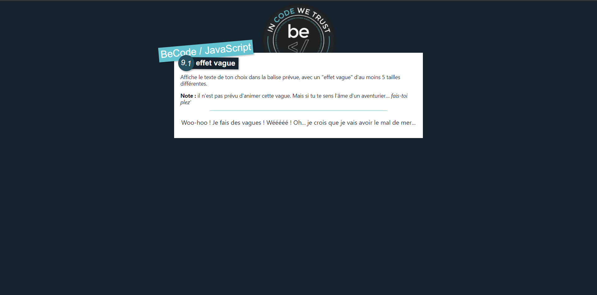

<h1 align="center">Exo JS</h1>

<!-- Table of content-->

 ## Table of content

* [Overview](#overview)
    * [Built With](#built-with)
    * [Built by](#built-by)

## Overview

Introduction to JS, A list of exercises to do 

### Built with

### Built by

**Vincent-Risk0**

    

