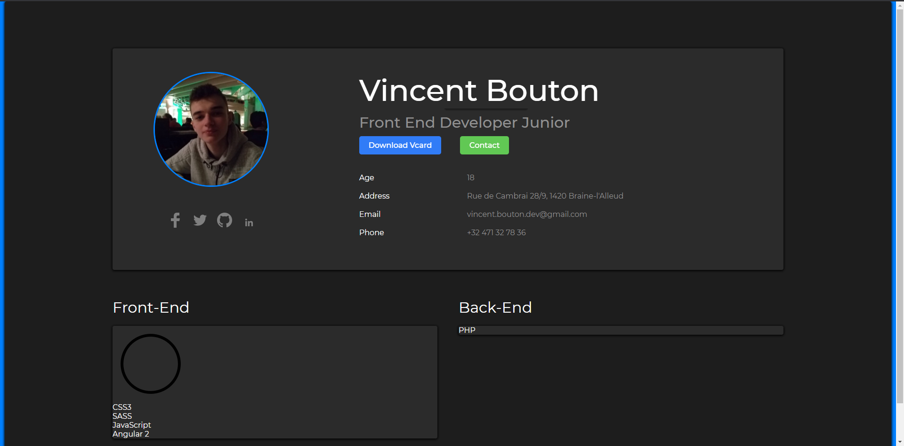

<h1 align="center">V-Card</h1>

<!-- Table of content-->

 ## Table of content

* [Overview](#overview)
    * [Built With](#built-with)
    * [Built by](#built-by)

## Overview

The objective was to do a site like Portefolio. And I start using the CSS preprocessor, Sass. Not finishing yet maybe later, or never. 😂

### Built with

    
    

    
    

### Built by

**Vincent-Risk0**

    

